<h1> 高考加油 </h1>
<audio autoplay="autoplay" loop="loop" controls="controls">
    <source src="./音乐/音阙诗听&小魂 - 赴梦 [mqms2].flac"
        type="audio/mpeg">
</audio>

# 数学学习

## 初中内容复习

### 常用公式

- 平方差公式：
  - $\boxed{a^{2}-{b^{2}}=(a-b)(a+b)}$
  - $\boxed{(a+b+c)^{2}=a^{2}+b^{2}+c^{2}+2ac+2bc}$
- 完全平方公式
  - $\boxed{(a\pm{b})^{2}=a^{2}\pm{2ab+b^{2}}}$
- 和立方公式：
  - $\boxed{(a+b)^{3}={a^{3}+3a^{2}b+3ab^{2}+b^{3}}}$
- 差立方公式：
  - $\boxed{(a-b)^{3}=a^{3}-3a^{2}b+3ab^{2}-b^{3}}$
- 立方差公式：
  - $\boxed{a^{3}-b^{3}=(a-b)(a^{2}+ab+b^{2})}$
- 立方和公式
  - $\boxed{a^{3}+b^{3}=(a+b)(a^{2}-ab+b^{2})}$
- 两根之差的绝对值
  - $\boxed{|x_{1}+x_{2}|=\sqrt{x_{1}(-x_{2})^{2}}=\frac{\sqrt{\Delta}}{a}}$

### 常用公式的应用

- 例1：
  - $已知a=1996x+1995,b=1996x+1996,c=1996x+1997,那么a^{2}+b^{2}+c{2}-ab-bc-ca的值为（）$
    Ａ．１　　　　Ｂ．２　　　　Ｃ．３　　　　Ｄ．４
    - 解析：
      $a^{2}+b^{2}+c{2}-ab-bc-ca=\frac{2(a^{2}+b^{2}+c^{2}-ab-bc-ca)}{2}$
      $\frac{2(a^{2}+b^{2}+c^{2}-ab-bc-ca)}{2}＝\frac{２a^{2}+２b^{2}+２c^{2}-２ab-２bc-２ca}{2}$

### 十字相乘

- $ \boxed{y=ax^{2}+bx+c  \Rightarrow y=(a_1x+c_1)(a_2x+c_2)}$
  - 使用条件&注意事项
    1. $常数必须为整数才可以使用，即a,b,c为整数$
  - 例:
    - $y=x^2-3x+2\Rightarrow y=(x-1)(x-2)$
      1　　   　　 1　　$x-1$
      　　$\nwarrow$$\nearrow$
      　　$\swarrow$$\searrow$
      1　　　  　  2　　$x-2 $

### 二次函数

- $\boxed{f(x)=ax^{2}+bx+c}$

  - 参数含义

    - a:控制开口方向
    - b:$\Delta 与x轴$
    - c:$\Delta 与y轴的焦点$
  - $\Delta$:

    - $\Delta公式：\boxed{\Delta=b^{2}-4ac}$
    - $\Delta图像$：
      - |         $\Delta>0$         |       $\Delta=0$       |       $\Delta<0$       |
        | :---------------------------: | :----------------------: | :----------------------: |
        |   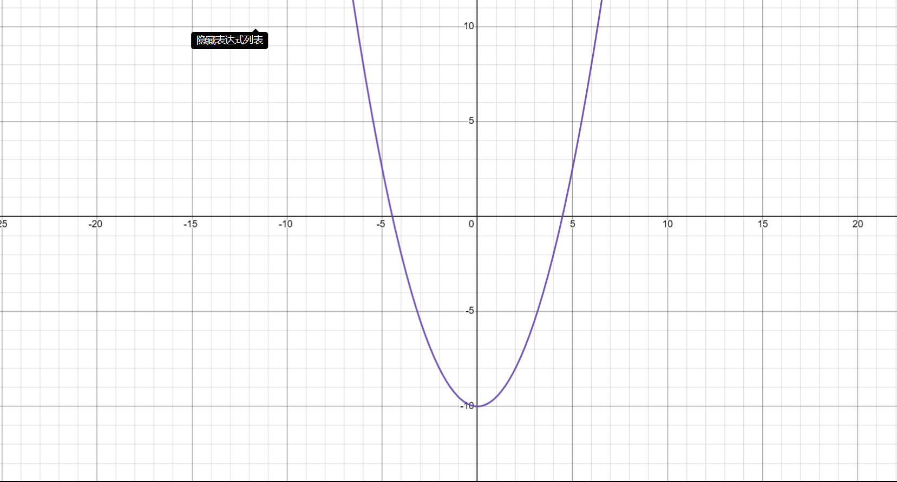   | 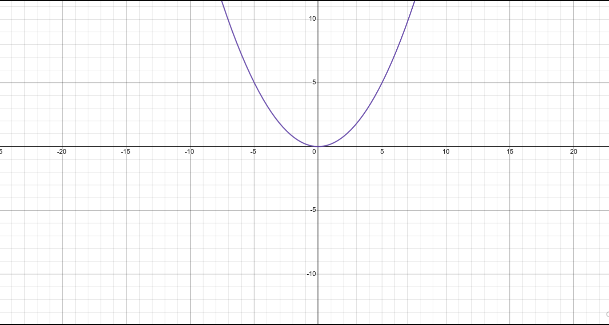 | 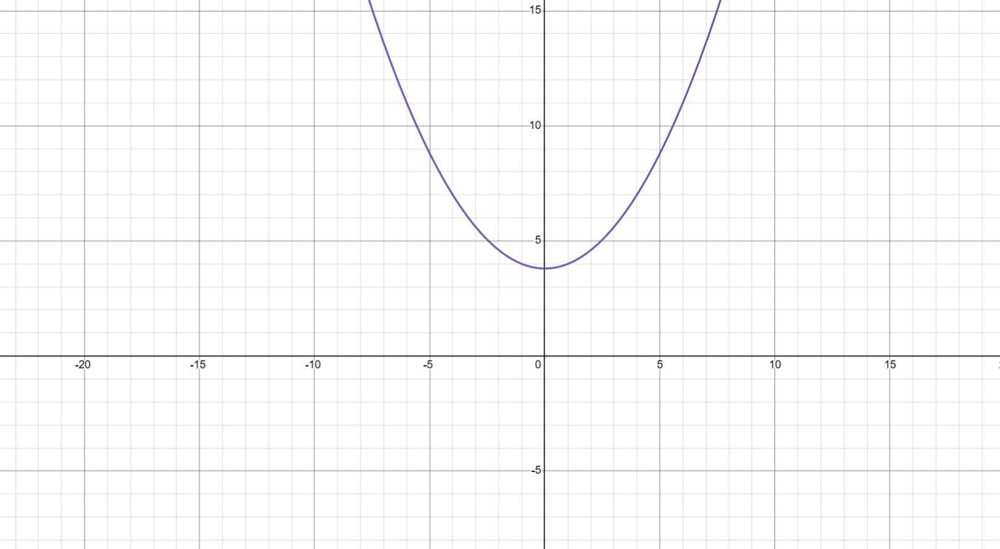 |
        | $图像与x轴有一个以上的焦点$ | $图像与x轴有一个焦点$ |  $图像与x轴没有焦点$  |
  - 二次函数求根公式：

    - $\boxed{\frac{-b^{2}\pm{\sqrt{b^2-4ac}}}{2a}}$
      1. 作用：$确认x轴的两个焦点$
      2. 使用条件：$\Delta>0$
  - 对称轴：

    - $x=-\frac{b}{2a}$
    - 特殊情况：$b=0时对称轴为(0,0)$
  - 顶点：

    - $(-\frac{b}{2a},\frac{4ac-b^{2}}{4a})$
- 图像：

  - |           a<0           |           a>0           |
    | :----------------------: | :----------------------: |
    | 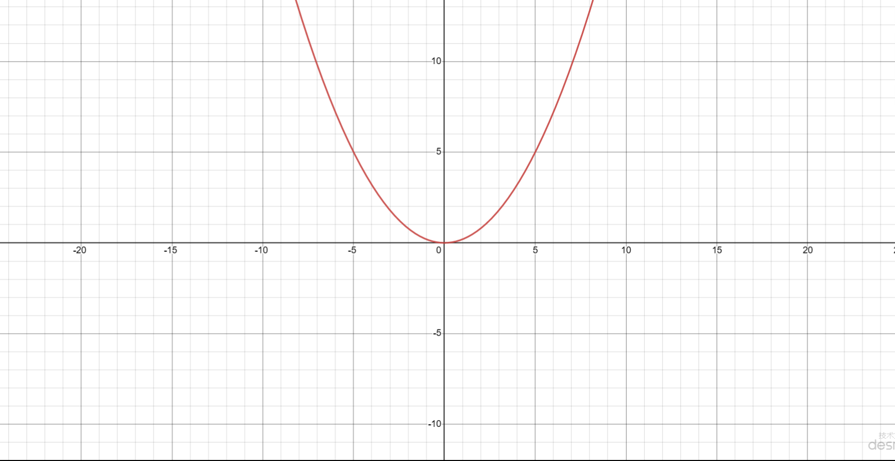 | 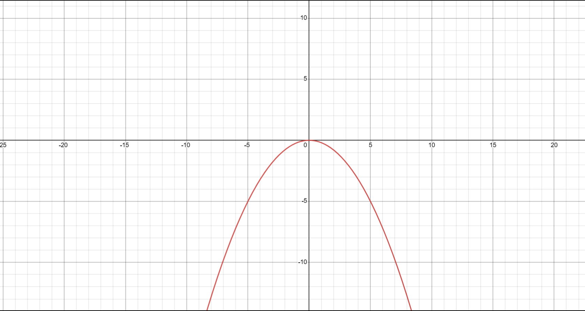 |

### 韦达定理

- $x_1+x_2=\frac{a}{b}$
- $x_1x_2=\frac{c}{a}$
- 使用条件：
  - $\Delta\geqslant 0$

## 高中数学

### 充分条件与必要条件

- 命题

  - | 概念 | 使用语言、符号或者式子表达可以判断真假的陈述句 |
    | :--: | :--------------------------------------------: |
    | 特点 |            (1)能判断真假；(2)陈述句            |
    | 分类 |                 真命题、假命题                 |
- 命题的结构：
  　　　　　　一般的，一个命题由条件和结论两部分组成，条件是已知项，结论是由已知项推出的事项.在数学中有许多命题可以写成$“若p则q的形式，其中p称为命题的条件，q称为命题的结论”$
- 四种命题中真假性的等价关系
  　　　　　　　　　　　　　　原命题，等价于逆命题，原命题的否命题等价于它的逆命题．在四种形式的命题在真命题的个数只能说偶数个
- 充分条件与必要条件的判定：

  - <table>
      <tr align=center>
        <th colspan='2'>若p⇒q,则p是q的充分条件，q是p的必要条件</th>
        <th colspan='2'>p成立的对象的集合为A,q成立的对象的集合为B</th>
      </tr>
      <tr align=center>
        <td>p是q的充分不必要条件</td>
        <td>p⇒q 且 q⇏p</td>
        <td>A是B的真子集</td>
        <th rowspan="4">集合与充分条件</th>
      </tr>
      <tr align=center>
        <td>p是q的必要不充分要条件</td>
        <td>p⇏q 且 q⇒p</td>
        <td>B是A的真子集</td>
      </tr>
      <tr align=center>
        <td>p是q的充要条件</td>
        <td>p⇔q</td>
        <td>A=B</td>
      </tr>
      <tr align=center>
        <td>p是q不充分也不必要条件</td>
        <td>p⇏q 且 q⇏p</td>
        <td>A,B互不包含</td>
      </tr>
    </table>

#### 全称量词与存在量词

- 全称量词与全称量词命题

  - <table>
      <tr align=center>
        <th rowspan='2'>全称量词</th>
        <td>定义</td>
        <td>短语“所有的”，“任意一个”在逻辑中通常叫做全称量词</td>
      </tr>
      <tr align=center>
        <td>符号表示</td>
        <td>∀</td>
      </tr>
      <tr align=center>
        <th rowspan='3'>全称量词命题</th>
        <td>定义</td>
        <td>含有全称量词的命题叫做全称量词命题</td>
      </tr>
      <tr align=center>
        <td>一般形式</td>
        <td>对任意M中任意一个x,p(x)成立</td>
      </tr>
      <tr align=center>
        <td>符号表示</td>
        <td>∀x∈M,p(x)</td>
      </tr>
    </table>
- 存在量词与存在量词命题

  - <table>
      <tr align=center>
        <th rowspan='2'>存在量词</th>
        <td>定义</td>
        <td>短语“存在一个”“至少有一个”在逻辑中通常叫做存在量词</td>
      </tr>
      <tr align=center>
        <td>符号表示</td>
        <td>∃</td>
      </tr>
      <tr align=center>
        <th rowspan='3'>存在量词命题</th>
        <td>定义</td>
        <td>含有存在量词的命题叫做存在量词命题</td>
      </tr>
      <tr align=center>
        <td>一般形式</td>
        <td>存在M中的元素x,p(x)成立</td>
      </tr>
      <tr align=center>
        <td>符号表示</td>
        <td>∃x∈M,p(x)</td>
      </tr>
    </table>
- 全称量词（存在量词）的命题否定
- <table>
    <tr align=center>
      <td>命题</td>
      <td>命题的否定</td>
    </tr>
    <tr align=center>
      <td>∀x∈M, p(x)</td>
      <td>∃x∈M, ¬ p(x)</td>
    </tr>
    <tr align=center>
     <td>∃x∈M,p(x)</td>
     <td>∀x∈M, ¬ p(x)</td>
    </tr>
  </table>

### 一元二次函数方程和不等式

#### 不等式的性质与一元二次不等式

- 不等式的定义：
  - $用“>” “\geqslant” “<” “\leqslant” “\not ={}”连接两个数或代数式表示不等关系，这样的式子叫做不等式$
- 不等式的性质：
- |         别名         |                                                          性质内容                                                          |    注意    |
  | :------------------: | :------------------------------------------------------------------------------------------------------------------------: | :---------: |
  |        对称性        |                                                $a>b \Leftrightarrow b<a $                                                |    可逆    |
  |        传递性        |                                                $a>b,b>c \Rightarrow a>c$                                                |    同向    |
  |        可加性        |                                              $a>b \Leftrightarrow a+c>b+c$                                              |    可逆    |
  |       移项法则       |                                              $a+b>c \Leftrightarrow a>c-b$                                              |    可逆    |
  |        可乘性        | $\begin{rcases} a>b \\ c>0\\ \end{rcases}\Rightarrow ac >bc; \begin{rcases} a>b \\ c<0\\ \end{rcases}\Rightarrow ac <bc$ | $c的符号$ |
  |      通向可加性      |                              $\begin{rcases} a>b \\ c>d\\ \end{rcases}\Rightarrow a+c>b+d$                              |    同向    |
  | 同向同正 可乘性 |                             $\begin{rcases} a>b>0 \\ c>d>0\\ \end{rcases}\Rightarrow ac>bd$                             |  同向同正  |
  |       可乘方性       |                                   $a>b>0\Rightarrow a^{n} > b^{n}(n\in\N,n\geqslant2)$                                   |    同正    |
  |       可开方性       |                                        $a>b>0\Rightarrow \sqrt[n]{a}>\sqrt[3]{b}$                                        |    同正    |

#### 一元二次不等式的解法与应用

- 定义：含有一个未知数，并且未知数的最高次数为2的不等式
- 一元二次函数与一元二次方程、不等式解的对应关系：
  - | $\Delta=b^{2}-4ac（a>0）的图像$ |                                    $\Delta>0$                                    |                    $\Delta=0$                    |                    $\Delta<0$                    |
    | :-------------------------------: | :---------------------------------------------------------------------------------: | :-------------------------------------------------: | :-------------------------------------------------: |
    |         $y=aX^{2}+bx+c$         |                                  |  |  |
    |    $\Delta=b^{2}-4ac（a>0）$    |                                    $\Delta>0$                                    |                    $\Delta=0$                    |                    $\Delta<0$                    |
    |   $ax^{2}+bx+c=0（a>0）的根$   | $有两个不相等的实数根x_{1},x_{2}=\frac{-b\pm\sqrt{b^{2}-4ac}}{2a}（x_{1}<x_{2}）$ |   $有两个相等的实数根x_{1}=x_{2}=-\frac{b}{2a}$   |                      无实数根                      |
    |  $ax^{2}+bx+c>0（a>0）的解集$  |                             {${x|x<x_{1}或x>x_{2}}$}                             |           ${x|x\not ={-\frac{b}{2a}}}$           |                       $\R$                       |
    |  $ax^{2}+bx+c<0（a>0）的解集$  |                      {$x|x_{1}<x<x_{2}$}（即“小于取中间”）                      |                   $\varnothing$                   |                   $\varnothing$                   |
  - 分式不等式的解法
    $\frac{f(x)}{g(x)} >0\Leftrightarrow \begin{cases} f(x)>0, \\ g(x)>0,\end{cases}或\begin{cases}f(x)<0, \\ g(x)<0,\end{cases}\Leftrightarrow f(x)·g(x)>0;$

    $\frac{f(x)}{g(x)}<0\Leftrightarrow \begin{cases} f(x)>0, \\ g(x)<0,\end{cases}或\begin{cases} f(x)<0, \\ g(x)>0,\end{cases}\Leftrightarrow f(x)·g(x)<0;$

    $\frac{f(x)}{g(x)}\geqslant 0 \Leftrightarrow\begin{cases}f(x)·g(x)\geqslant0, \\ g(x)\not =0,\end{cases}\Leftrightarrow f(x)·g(x)>0 或 f(x)=0;$

    $\frac{f(x)}{g(x)} \leqslant 0\Leftrightarrow\begin{cases}f(x)·g(x)\leqslant 0, \\ g(x)\not ={0},\end{cases}\Leftrightarrow f(x)·g(x)<0 或f(x)=0;$

### 基本不等式

- 基本不等式：$\sqrt{ab}\leqslant\frac{a+b}{2}$

  1. 基本不等式成立条件：$a>0,b>0$
  2. 等号的成立条件：$当且仅当a=b时等号成立$
- 几个重要的不等式

  - |                        不等式                        |      条件      |
    | :---------------------------------------------------: | :------------: |
    |             $a^{2}+b^{2}\geqslant 2ab$             | $(a,b\in\R)$ |
    |         $\frac{b}{a}+\frac{a}{d}\geqslant2$         | $(a,b同号)$ |
    |          $ab\leqslant(\frac{a+b}{2})^{2}$          | $(a,b\in\R)$ |
    | $\frac{a^{2}+b^{2}}{2}\geqslant(\frac{a+b}{2})^{2}$ | $(a.b\in\R)$ |
    |    $(a+b)+(\frac{1}{a}+\frac{1}{b})\geqslant 4$    |   $(ab>0)$   |
- 最值定理：
  已知$x>0,y>0,则$

  1. $如果积xy是定值p，那么当且仅当x=y时x+y有最小值2\sqrt{p}$
  2. $如果积x+y是定值p，那么当且仅当x=y时xy有最大值\frac{p^{2}}{4}$
- 基本不等式使用条件（一正，二定，三相等）

  - 一正：$xy都是正数$
  - 二定：$xy或（x+y）是定值$
  - 三相等：$x与y必须能够相等$
- 方法：

  - 对于已知$()x+d()=()$让求$\frac{()}{a}+\frac{()}{b}$的最小值的类型可以考虑使用1代换凑成为积定值

### 函数

- 函数的概念

  - $设A，B是非空实数集，如果对于集合A中的\textcolor{Red}{任意一个数}x按照某种\textcolor{Red}{对应关系}f，在集合B中\textcolor{Red}{都有唯一确定}的数y和它对应，那么就称f:A\rightarrow B为集合A到集合B的一个函数，记做y=f(x)，x\in A$
- 函数的构成要素

  - 一个函数的构成要素为：定义域、对应关系和值域
  - 值域是由定义域和对应关系决定的
  - 两个函数的定义域相同，并且对应关系一致那么就称两个函数是同一个函数或相等
- 函数的定义域

  - 函数的定义域就是使这个函数有意义的实数的全体构成的集合
- 求函数定义域时列不等式组的主要依据

  1. 分式分母不为0
  2. 偶次根式的被开方数大于等于0
  3. 非正数次幂底数不为0
  4. 对数的真数大于0，底数大于0且不等于1
  5. 正切函数$y=\tan{x}中x \not = k\pi+\frac{\pi}{2},k\in{\Z}$
  6. 如果函数是一些基本函数通过四则运算结合而成的那它的定义域是使各部分都有意义的x的值组成的集合
- 复合函数定义域的求法

  - $已知函数y=f(x)的定义域是A求y=f(g(x))的定义域，其实质是已知函数g(x)的取值范 围为A求出x的取值范围$
  - 已知$y=f(g(x))的定义域是B，求f(x)的定义域是B，求y=f(x)的定义域其实质是已知f(g(x))中的取值范围·为B求韩式B(x)的取值范围$
- 函数的值域

  - 定义：
    - 对于函数$y=f(x),x\in{A}，与x相对应的y值叫函数值，函数值的集合${$f{x}|x\in{A}$}叫函数的值域
  - 求函数值域的常用方法
    1. 观察法 ：对于函数的结构并不复杂的可以通过解析式的变形和观察，利用熟知的函数的值域求出原函数的值域
    2. 换元法：运用换元，将已知函数转换为值域容易确认的另一函数从而求的原函数值域
    3. 配方法：若所给函数是二次函数形式，即可转化为$y=ax^{2}+bx+c(a\not ={a})$形式的函数，则可通过配方后结合二次函数的性质求出值域
    4. 判别式法：对于如$y=\frac{ax^{2}+bx+c}{dx^{2}+ex+f}(a,d中至少有一个不为0)$的函数利用去分母的方法把函数转换为关于$x$的二次函数方程$F(x,y)$,通过方程有实数根即$\Delta \geqslant{0}$,求出$y$的取值范围从而确定值域
    5. 图像法：有些函数的图像比较容易画出，可以通过所画函数图像得出函数值域
    6. 分离常数法：此方法主要是针对有理分式，即将有理分式转化为反比例函数的形式，便于求出值域.$y=\frac{ax+b}{cx+d}型\Rightarrow y=\frac{a}{c}+\frac{k}{cx+d},值域$：{$y|y\not ={\frac{a}{c}}$}
  - 区间
    - |               定义               |     名称     |   符号   |            数轴表示            |
      | :-------------------------------: | :----------: | :-------: | :----------------------------: |
      | {$x|a\leqslant{x}\leqslant{b}$} |    闭区间    | $[a,b]$ |    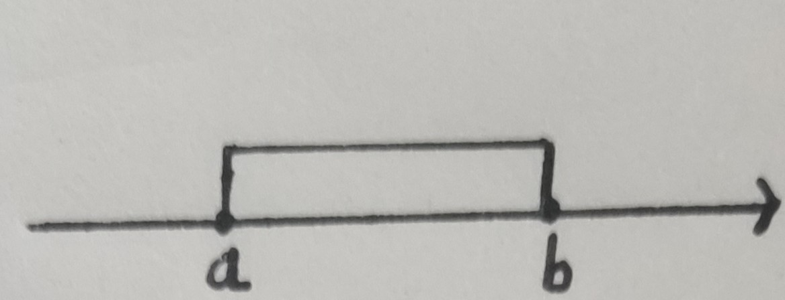    |
      |           {$x|a<x<b$}           |    开区间    | $(a,b)$ |        |
      |      {$x|a\leqslant{x}<b$}      | 半开半壁区间 | $[a,b)$ |  |
      |      {$x|a<x\leqslant{b}$}      | 半开半壁区间 | $(a,b]$ |          |
  - 特殊区间的表示
    - | 定义 | {$x|x\geqslant{a}$} |   {$x|x>a$}   | {$x|x\leqslant{b}$} |   {$x|x<b$}   |
      | :--: | :-------------------: | :-------------: | :-------------------: | :-------------: |
      | 记法 |    $[a,+\infty)$    | $(a,+\infty)$ |    $(-\infty,b]$    | $(+\infty,b)$ |
      | 数轴 |                      |                |                      |                |
- 单调性运算的结论:如函数$f(x)$和$g(x)$在区间上具有单调性则

  1. 在区间D上若$\textcolor{purple}{a>0}则\textcolor{red}{af(x)与f(x)单调性相同}若\textcolor{purple}{a<0}则\textcolor{red}{af(x)与f(x)单调性相反}$
  2. 若$\textcolor{purple}{f(x)和g(x)单调性相同}则\textcolor{red}{f(x)+g(x)的单调性与它们也相同}$
  3. $\textcolor{purple}{f(x)>0,g(x)>0,且f(x)和g(x)单调性相同}则\textcolor{red}{f(x)g(x)单调性与他们也相同}$
- 复合函数单调性判断准则：同增异减
- 奇函数的性质：

  1. $\textcolor{red}{f(-x)=-f(x)}$
  2. $\textcolor{red}{图像关于原点对称}；若\textcolor{purple}{x=0}处有定义，则\textcolor{red}{f(x)=0}$
- 偶函数的性质：

  1. $\textcolor{red}{满足f(-x)=f(x)}$
  2. $\textcolor{red}{图像关于y轴对称}$
- 常见的几个奇函数：

  1. $f(x)=\log_{a}\frac{m+x}{m-x}$
  2. $f(x)=\log_{a}\frac{m-x}{m+x}$
  3. $f(x)=\log_{a}\sqrt{m^{2}x^{2}+1}+mx$
  4. $f(x)=\log_{a}\sqrt{m^{2}x^{2}+1}-mx$
  5. $f(x)=a^{x}-a^{-x}$
  6. $f(x)=\frac{a^{x}+1}{a^{x}-1}$
- 奇偶性加减法结论：

  1. $\textcolor{red}{奇 \pm 奇 = 奇}$
  2. $\textcolor{red}{偶 \pm 偶 = 偶}$
  3. $\textcolor{red}{偶 \pm 偶 = 非奇非偶}$
- 奇偶性乘除法结论

  1. $\textcolor{red}{奇 \times 奇 = 偶}$
  2. $\textcolor{red}{奇 \times 偶 = 奇}$
  3. $\textcolor{red}{偶 \times 偶 = 偶}$
  4. $\textcolor{red}{奇 \div 奇 = 偶}$
  5. $\textcolor{red}{偶 \div 奇 = 奇}$
  6. $\textcolor{red}{偶 \div 偶 = 偶}$

- 如论$\textcolor{red}{y=f(|x|)和y=f(-|x|)都是偶函数}$

- 若$\textcolor{purple}{f(x)是奇函数或偶函数}则\textcolor{red}{函数y=f(|x|)是偶函数}$

### 三角函数

- 三角函数的定义
  - |      函数名称      |                              $\sin 函数$                              |                       $\cos 函数$                       |                         $\tan 函数$                         |
    | :----------------: | :----------------------------------------------------------------------: | :--------------------------------------------------------: | :-----------------------------------------------------------: |
    |        定义        | $sin函数：比值\frac{y}{r}叫做\alpha,记作\sin\alpha,即\sin=\frac{y}{r}$ | $\cos函数：比值\frac{x}{r}，记作\cos,即\cos=\frac{x}{r}$ | $\tan 函数：比值\frac{x}{y}，记作\tan,即\tan=\frac{tan}{r}$ |
    |      锐角图像      |             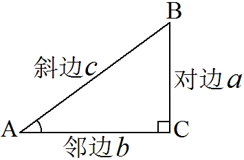             |            |              |
    | 锐角三角函数的关系 |                          $\sin A=\frac{a}{c}$                          |                   $\cos A=\frac{b}{c}$                   |                    $\tan A=\frac{x}{y}$                    |
    |  任意三角函数图像  |             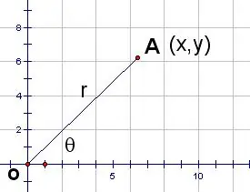             |       |              |
    | 任意三角函数的关系 |                       $\sin \theta=\frac{x}{r}$                       |                $\sin \theta=\frac{y}{r}$                |                  $\sin \theta=\frac{x}{y}$                  |

#### 同角三角函数的基本关系

- $\boxed{\sin^{2}\alpha+\cos^{2}\alpha}$
- $\boxed{\tan\alpha=\frac{\sin\alpha}{\cos\alpha}}$

#### 诱导公式

- $\boxed{奇变偶不变符号看象限}$
- |                  公式一                  |                 公式二                 |              公式三              |                 公式四                 |                    公式五                    |                     公式六                     |                    补充                    |
  | :--------------------------------------: | :------------------------------------: | :-------------------------------: | :------------------------------------: | :-------------------------------------------: | :--------------------------------------------: | :-----------------------------------------: |
  | $\sin{(k·2\pi{\alpha})}=\sin{\alpha}$ |  $\sin(\pi +\alpha)=-\sin{\alpha}$  | $\sin{(-\alpha)}=-\sin{\alpha}$ | $\sin{(\pi - \alpha)}=\sin{\alpha}$ | $\sin{(\frac{\pi}{2}-\alpha)}=\cos{\alpha}$ | $\sin{(\frac{\pi}{2}+\alpha)}=\cos{\alpha}$ | $\sin(\frac{3\pi}{2}+\alpha)=\sin\alpha$ |
  | $\cos{(k·2\pi{\alpha})}=\cos{\alpha}$ | $\cos{(\pi + \alpha)}=-\sin{\alpha}$ |  $\cos{-\alpha}=\cos{\alpha}$  | $\cos{(\pi - \alpha)}=-\cos{\alpha}$ | $\cos{(\frac{\pi}{2}-\alpha)}=\sin{\alpha}$ | $\cos{(\frac{\pi}{2}+\alpha)}=-\sin{\alpha}$ | $\cos(\frac{3\pi}{2}-\alpha)=-\cos\alpha$ |
  |  $\tan{k·2\pi{\alpha}}=\tan{\alpha}$  | $\tan{(\pi + \alpha)}=-\tan(\alpha)$ |  $\tan(-\alpha)=-\tan{\alpha}$  |  $\tan{(\pi-\alpha)}=-\tan{\alpha}$  |                       /                       |                       /                       | $\cos(\frac{3\pi}{2}+\alpha)=\sin\alpha$ |

#### 三角函数的图像和性质

- 三角函数的定义域与值域
  - |  函数  |                   $y=\sin x$                   |                   $y=\cos x$                   |                    $y=\tan x$                    |
    | :----: | :----------------------------------------------: | :----------------------------------------------: | :-------------------------------------------------: |
    |  图像  | 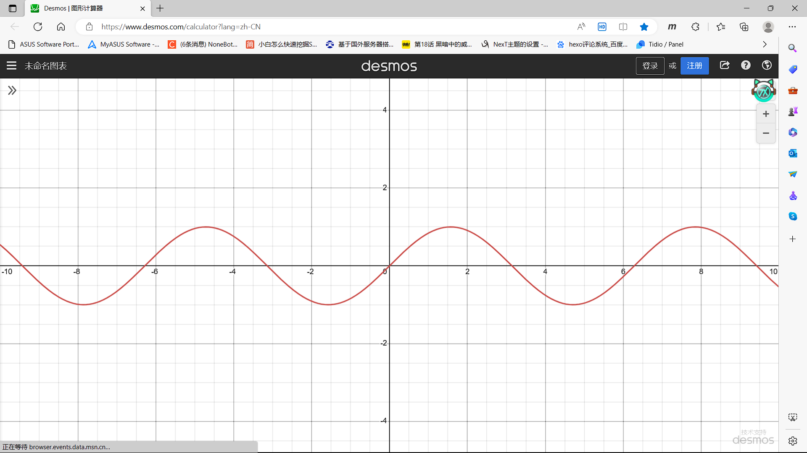 | 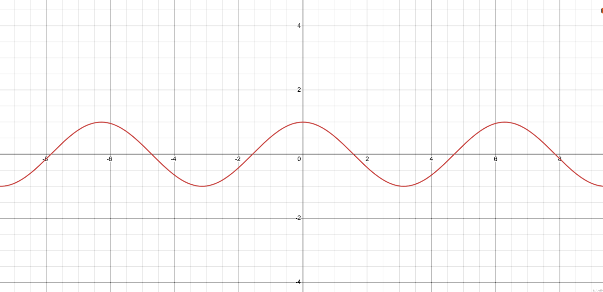 |  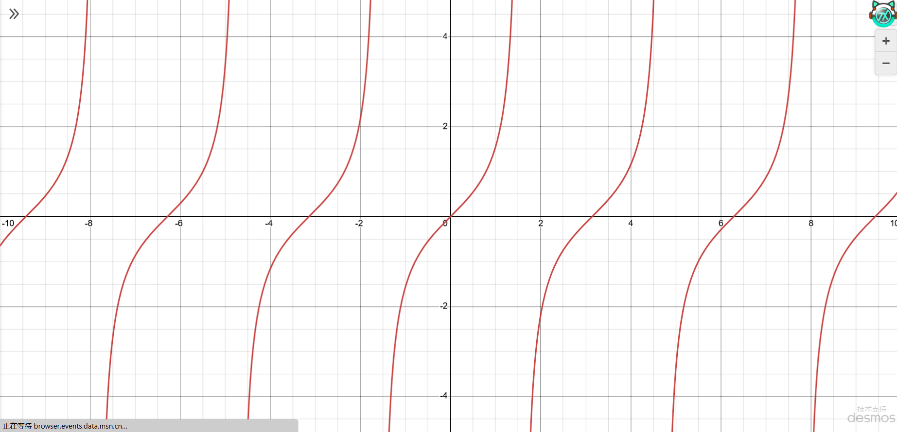  |
    | 定义域 |                        R                        |                        R                        | {$x|x\in R,且x\not ={k\pi+\frac{\pi}{2},k\in Z}$} |
    |  值域  |                      [-1,1]                      |                      [-1,1]                      |                          R                          |
- 三角函数的单调性
  - |  函数  |                                                        $y=\sin x$                                                        |                                  $y=\cos x$                                  |                        $y=\tan x$                        |
    | :----: | :-------------------------------------------------------------------------------------------------------------------------: | :-----------------------------------------------------------------------------: | :---------------------------------------------------------: |
    |  图像  |                                      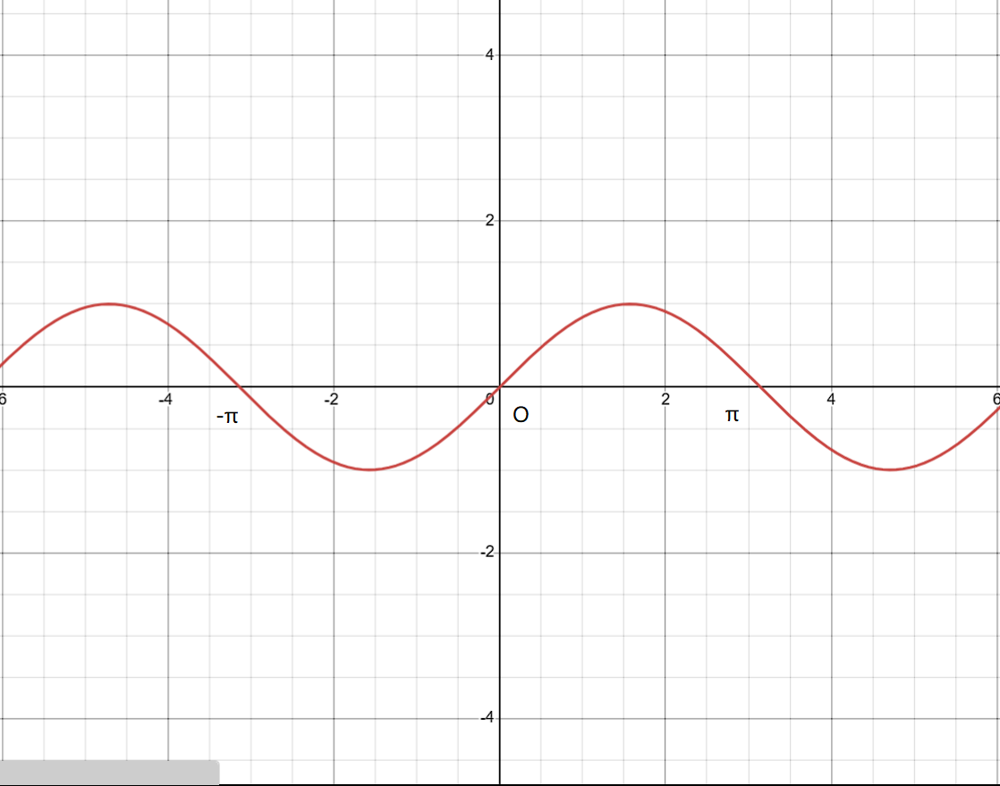                                      |                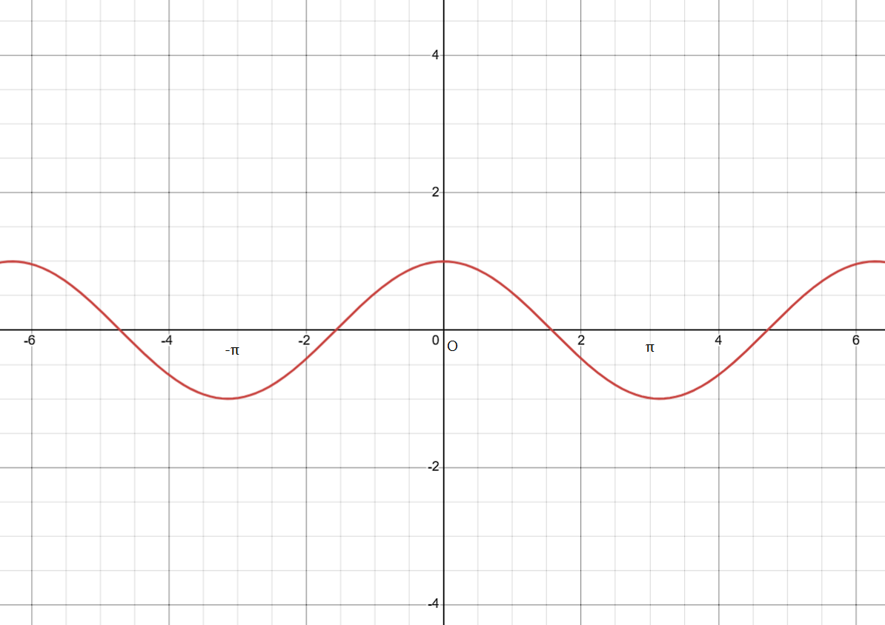                |      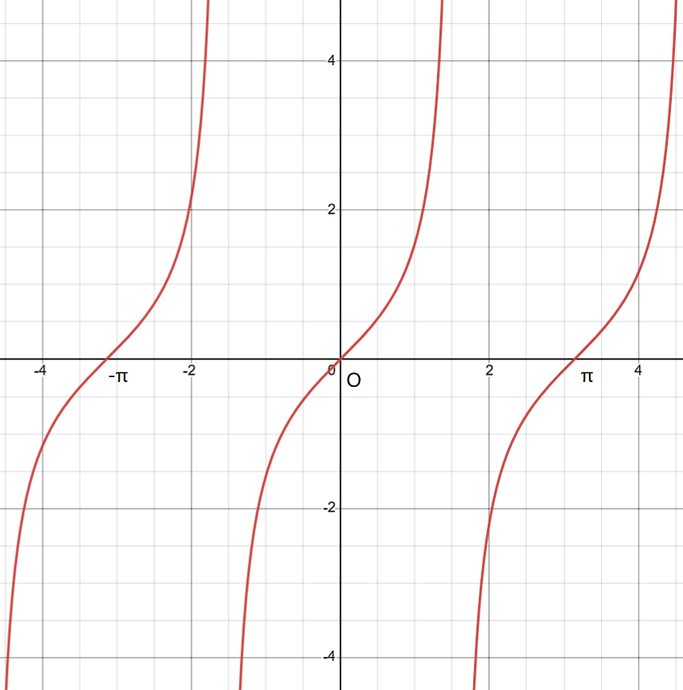      |
    |  函数  |                                                        $y=\sin x$                                                        |                                  $y=\cos x$                                  |                        $y=\tan x$                        |
    | 单调性 | $在[2k\pi-\frac{\pi}{2}，2k\pi+\frac{\pi}{2}](k\in\Z)上单调递增;在p[2k\pi +\frac{\pi}{2},2k\pi+\frac{3\pi}{2}]上单调递减$ | $在[2k\pi,2k\pi+\pi](k\in\Z)上单调递减;在[2k\pi-\pi,2k\pi](k\in\Z)上单调递增$ | $在(k\pi-\frac{\pi}{2},k\pi+\frac{\pi}{2})(k\in\Z)上单调$ |
- 三角函数的周期性
  - 周期性定义
    $一般地，设函数f(x)的定义域为D如果存在一个\textcolor{Red}{非0的常数T},使得\textcolor{Red}{对每一个(x\in D)}都有x+T\in D,且\textcolor{Red}{f(x+T)=f(x)},那么函数f(x)就叫做周期函数,非0常数T叫做这个函数的周期.$
  - 最小正周期
    $如果在周期函数f(x)的所有周期中存在一个最小正数那么这个最小的正数就叫做f(x)的最小正周期.$
    $根据上述定义我们有:\textcolor{Yellow}{正弦函数是周期,2k\pi(k\in\Z,且k\not ={0})都是它的周期,最小正周期是2\pi}.$
    $类似地,\textcolor{Yellow}{余弦函数也是周期函数,2k\pi(k\in\Z,且k\not ={0})都是它的周期,最小正周期是2\pi}$
  - $函数`A\sin{(\omega+\phi)}及`A\cos{(\omega+\phi)}的周期$
    $函数`A\sin{(\omega+\phi)}及函数`A\cos{(\omega+\phi)}(其中A,\phi,\omega为常数,且A\not ={0},\omega>0,x\in\R)则两函数最小最小正周期为\frac{2\pi}{2}$

#### 两角和与差正弦、余弦和正切公式、二倍角公式

- 两角和与差的正弦、余弦和正切公式

  1. $\boxed{C_{(\alpha+\beta)}:\cos(\alpha+\beta)=\cos\alpha\cos\beta-\sin\alpha\sin\beta.}$
  2. $\boxed{C_{(\alpha-\beta)}:\cos(\alpha-\beta)=\cos\alpha\cos\beta+\sin\alpha\sin\beta.}$
  3. $\boxed{S_{(\alpha+\beta)}:\sin(\alpha+\beta)=\sin\alpha\cos\beta+\sin\beta\cos\beta.}$
  4. $\boxed{S_{(\alpha-\beta)}:\sin(\alpha-\beta)=\sin\alpha\cos\beta-\sin\beta\cos\beta.}$
  5. $\boxed{T_{(\alpha+\beta)}:\tan(\alpha+\beta)=\frac{\tan\alpha+\tan\beta}{1-\tan\alpha\tan\beta}.}$
  6. $\boxed{T_{(\alpha-\beta)}:\tan(\alpha-\beta)=\frac{\tan\alpha-\tan\beta}{1+\tan\alpha\tan\beta}.}$
- 二倍角公式

  1. $\boxed{S_{2\alpha}:\sin 2\alpha=2\sin\alpha\cos\alpha.}$
  2. $\boxed{C_{2\alpha}:\cos 2\alpha=\cos^{2}\alpha-\sin^{2}\alpha=2\cos^{2}\alpha-1=1-2\sin^{2}\alpha.}$
  3. $\boxed{T_{2\alpha}:\tan 2\alpha=\frac{2\tan\alpha}{1-\tan^{2}\alpha}.}$
- 半角公式

  1. $\sin\frac{\alpha}{2}=\sqrt{\frac{1-\cos\alpha}{2}}$
  2. $\cos\frac{\alpha}{2}=\sqrt{\frac{1+\cos\alpha}{2}}$
  3. $\tan\frac{\alpha}{2}=\sqrt{\frac{1-\cos\alpha}{1+\cos\alpha}}=\frac{\sin\alpha}{1+\cos\alpha}=\frac{1-\cos\alpha}{\sin\alpha}$
- 万能公式

  1. $\sin\alpha=\frac{2\tan\frac{\alpha}{2}}{1-\tan^{2}\frac{\alpha}{2}}$
  2. $\cos\alpha=\frac{1-\tan^{2}\frac{\alpha}{2}}{1+\tan^{2}\frac{\alpha}{2}}$
  3. $\tan\alpha=\frac{2\tan\frac{\alpha}{2}}{1-\tan^{2}\frac{\alpha}{2}}$
- 两角和差的正余弦&正切公式变形

  1. $T_{(\alpha+\beta)}的变形公式$
     1. $\tan(\alpha+\beta)(1-\tan\alpha\tan\beta)=\tan\alpha+\tan\beta$
     2. $\tan\alpha+\tan\beta+\tan\alpha\tan\beta\tan(\alef+\beta)=\tan\alpha+\beta$
     3. $\tan\alpha\tan\beta=1-\frac{\tan\alpha}{\tan(\alpha+\beta)}$
  2. 整体观念：
     - 将一个组合角看成一个整体
     - 例：
       - $\cos(\alpha-\beta)\cos\beta-\sin(\alpha-\beta)\sin\beta=\cos\alpha$
         化简：
         　　　$\cos(\alpha+\beta)\cos\beta-\sin(\alpha-\beta)\sin\beta$
         　　　　设$(\alpha+\beta)为x则:$
         　　　$\cos(\alpha+\beta)\cos\beta-\sin(x)\sin\beta=\cos(\alpha+\beta)\cos\beta-\sin(x)\sin\beta=\cos(x+\beta)=\cos(\alpha-\beta+\beta)=\cos\alpha$
- 倍角公式的逆向变换及有关变形

  1. $1\pm\sin 2\alpha=\sin^{2}\alpha+\cos^{2}\alpha\pm 2\sin\alpha\cos\alpha=(\sin\alpha\pm\sin\alpha)^{2}$
  2. 降幂公式:$\cos^{2}\alpha=\frac{1}{2}(1+\cos2\alpha)$
     　　　　$\sin^{2}\alpha=\frac{1}{2}(1-\cos2\alpha)$
     升幂公式:$1+\cos\alpha+2\cos^{2}\frac{\alpha}{2}$
     　　　　$1+\cos\alpha-2\cos^{2}\frac{\alpha}{2}$
- 辅助角公式

  1. $a\sin a+b\cos a=\sqrt{a^{2}+b^{2}}\sin(\alpha+\phi)(ab\not = 0),其中\phi 满足\tan\phi = \frac{b}{a}(\cos\phi=\frac{a}{\sqrt{a^{2}+b^{2}}},\sin\phi=\frac{b}{\sqrt{a^{2}+b^{2}}}),\phi所在的象限点由点(a,b所)在象限确定.$
- 三角函数中常见的变形

  - $A+B+C=\pi$
  - |     $A+B=\pi-C$     |    $2A+2B=2\pi-2C$    | $\frac{A}{2}+\frac{B}{2}=\frac{\pi}{2}-\frac{c}{2}$ |
    | :-------------------: | :----------------------: | :---------------------------------------------------: |
    | $\sin(A+B)=\sin C$ | $\sin(2A+2B)=-\sin C$ |         $\sin\frac{A+B}{2}=\cos\frac{C}{2}$         |
    | $\cos(A+B)=-\cos C$ | $\cos(2A+2B)=\cos 2C$ |         $\cos\frac{A+B}{2}=\sin\frac{C}{2}$         |
    | $\tan(A+B)=-\tan C$ | $\tan(2A+2B)=-\tan 2C$ |                           /                           |

##### 三角函数图像平移与伸缩

- $A,\omega,\phi,对y=\sin{\omega x+\phi},x\in{R}$
  1. $\phi对y=\sin{x+\phi},x\in{\phi}的图像的影响$
     - $当\phi>0时,y=\sin(x)图像上所有点向左平移|\phi|个单位长度$
     - $当\phi<0时,y=\sin(x)图像上所有点向右平移|\phi|个单位长度$
  2. $\omega(\omega>0)对y=\sin(\omega x+\phi),x\in R的图像的影响$
     - 当$\omega>1时,y=\sin(x+\phi)$图像上所有的点横坐标缩短为原来的$\frac{1}{\omega}$倍
     - 当$0<\omega<1$时,$y=\sin(x+\phi)$图像上所有的点横坐标伸长到原来的$\frac{1}{\omega}$倍
  3. $A(A>0)对y=A\sin(\omega x+\phi),x\in R的函数图像的影响$
     - $当A>1时，y=\sin(\omega x+\phi)图像上所有的点的纵坐标伸长到原来的A倍$
     - $当0<A<1时,y=\sin(\omega x+\phi)图像上所有的点纵坐标缩短为原来的A倍$
- 周期:$T=\frac{2\pi}{|\omega|}$
- *$\boxed{探究函数y=A\sin(\omega x+\phi)的性质时可利用换元的思想,将\omega x+\phi看作一个整体，结合\sin x,x\in R的性质求解}$*
- $函数y=A\sin(\omega x+\phi)的图像基本转换$
  - |                         原式                         |        $y=\sin x$        |                            原式                            |        $y=\sin x$        |
    | :--------------------------------------------------: | :------------------------: | :---------------------------------------------------------: | :------------------------: |
    |    $左移(\phi>0)或右移(\phi<0)　|\phi|个单位 $    |     $y=\sin(x+\phi)$     |    $横坐标伸缩到原来的\frac{1}{\omega}　纵坐标不变ａ$    |     $y=\sin\omega x$     |
    | $横坐标伸缩到原来的\frac{1}{\omega}倍　纵坐标不变$ | $y=\sin(\omega x+\phi)$ | $左移(\phi>0)或右移(\phi<0)　\frac{|\phi|}{\omega}个单位$ | $y=\sin(\omega x+\phi)$ |
    |    $纵坐标伸长(A>1)或缩短(0<A<1)　到原来的A倍$    | $y=A\sin(\omega x+\phi)$ |        $纵坐标伸长(A>1)或缩短(0<A<1)　到原来的A倍$        | $y=A\sin(\omega x+\phi)$ |

#### 正弦定理和余弦定理

- 正弦定理：

  $$
  \boxed{\frac{a}{\sin A}=\frac{b}{\sin B}=\frac{c}{\sin C}=2R}
  $$

  - 正弦定理的变形及常用结论:
    1. $\boxed{\frac{a}{b}=\frac{\sin A}{\sin B}},\boxed{\frac{b}{c}=\frac{\sin B}{\sin C}},\boxed{\frac{a}{c}=\frac{\sin A}{\sin C}}$
    2. $\boxed{a:b:c=\sin A:\sin B:\sin C}$
    3. $\boxed{a=2R\sin A},\boxed{b=2R\sin B},\boxed{c=2R\sin C}$
    4. $\boxed{A>B\Leftrightarrow a>b \Leftrightarrow \sin A > \sin B}$
- 正弦定理应用

  1. 已知三角形的任意一边解三角形：根据三角形内角和把另外一个角求出，然后根据正弦定理求其他两边。
  2. 已知两边和其中一边的对角，解三角形：根据正弦定理求另一边的对角，进而可求其他的边和角。
- 解三角形情况判断

  - <table>
      <tr align=center>
        <td colspan="4">A是锐角</td>
        <td colspan="2">A是直角或钝角</td>
      </tr>
      <tr align=center>
        <td rowspan='2'> a ⩾ b </td>
        <td colspan="3"> a < b </td>
        <td rowspan='2'> a > b</td>
        <td rowspan='2'> a ⩽ b</td>
      </tr>
      <tr align=center>
        <td>a > bsinA</td>
        <td>a = bsinA</td>
        <td>a < bsinA</td>
      </tr>
      <tr>
        <td>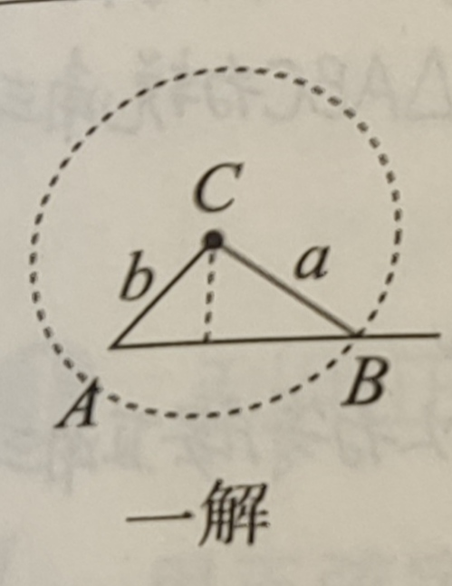</td>
        <td>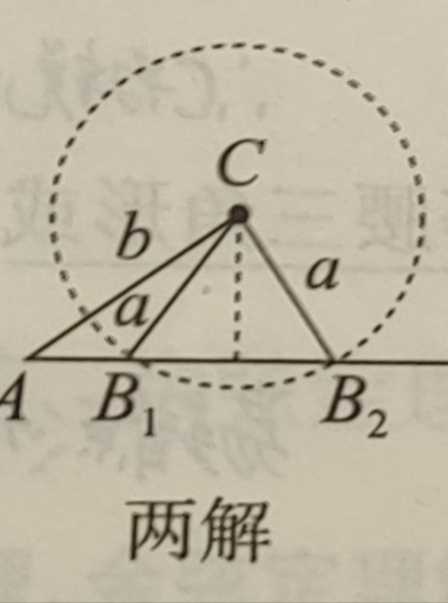</td>
        <td>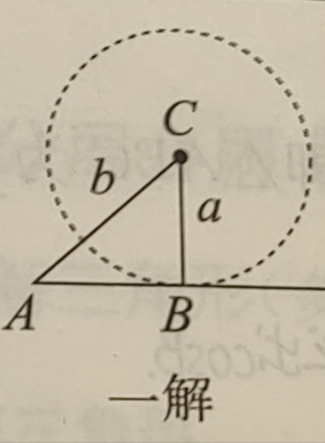</td>
        <td>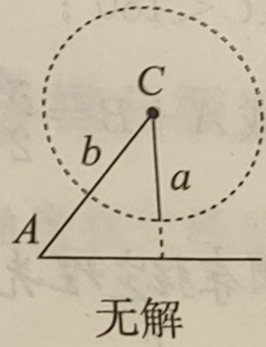</td>
        <td>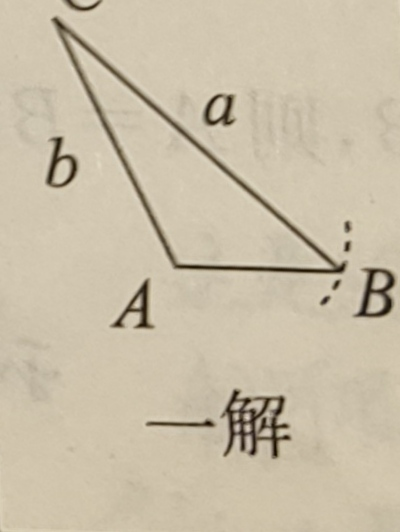</td>
        <td>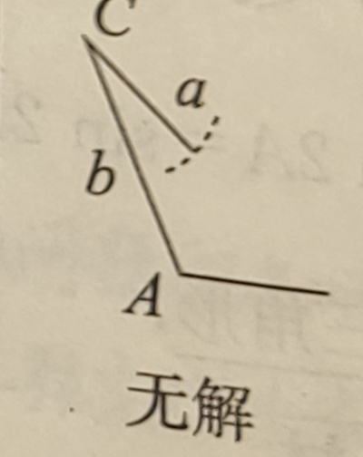</td>
      </tr>
    </table>
- 余弦定理：

  $$
  \boxed{a^{2}=b^{2}+c^{2}-2bc\cos A}
  $$

  $$
  \boxed{b^{2}=c^{2}+a^{2}-2ca\cos B}
  $$

  $$
  \boxed{c^{2}=a^{2}+b^{2}-2ab\cos C}
  $$

### 数列

- 定义：按照一定顺序排列的数
- 数列的分类：
  - |    分类标准    |   名称   |                                        含义                                        |                                              举例                                              |
    | :------------: | :------: | :--------------------------------------------------------------------------------: | :---------------------------------------------------------------------------------------------: |
    |   按项的个数   | 有穷数列 |                                   项数有限的数列                                   |                                     1,2,3.·······,n                                     |
    |                | 无穷数列 |                                   项数无限的数列                                   |                             {1,2,3,······,n,n+1,······}                             |
    | 按项的变化趋势 | 递增数列 | $从第二项起,每一项都大于前面一项的数列,即\forall{n\in{N^{*}},都有a_{n}<a_{n+1}}$ |                             2,4,6,5,10,······,2n,······                             |
    |                | 递减数列 | $从第二项起,每一项都小于前面一项的数列,即\forall{n\in{N^{*}},都有a_{n}>a_{n+1}}$ | $\frac{1}{3},\frac{1}{9},\frac{1}{27},\frac{1}{81},······,\frac{1}{3^{n}},······$ |
    |                |  常数列  |                                  各项都相等的数列                                  |                                      7,7,7,7,······                                      |
    |                | 摆动数列 |               从第二项起有些数大于它前一项，有些数小于它前一项的数列               |                                      -1,2-3,4,······                                      |
  - 通向公式定义：

    - 如果数列{$a_{n}$}的第$n$项与他的序号$n$之间的关系可以用一个式子表示，那么这个式子就叫做这个数列的通项公式
  - 递推公式定义：

    - 如果相邻的两项或多项可以1的关系可以用一个式子表示出来那么这个式子就叫做这个数列的递推公式
  - 等差数列的定义：

    - 一般的如果从第2项起，每一项与它的前一项的差都等同一个常数,那么这个数列就叫做等差数列
  - 等差中项的计算公式：

    - $$
      \boxed{G^{2}=ab}
      $$
- 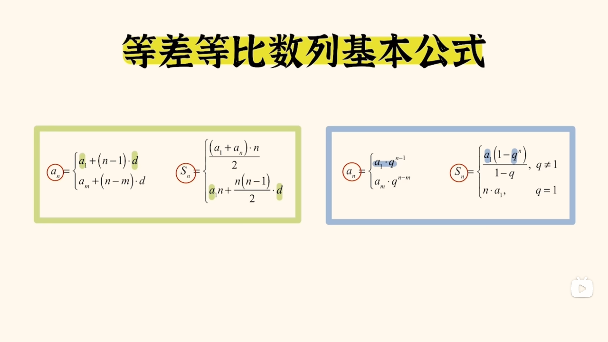
- 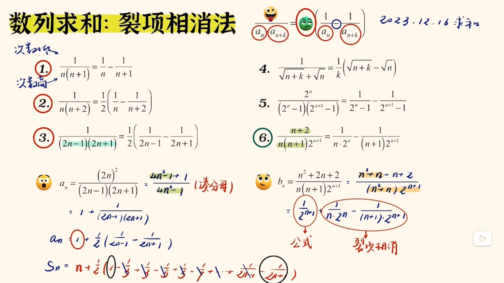

#### 等差数列

- 等差数列的通项公式：

  - $$
    \boxed{a_{n}=a_{m}+(n-m)d　(n,m\in \N^{*})}
    $$
- 求公差公式：

  - $$
    \boxed{d=\frac{a_{n}- a_{m}}{(n-m)}　(n\not = m)}
    $$
- 等差数列前n项求和公式：

  - $$
    \boxed{S_{n}=\frac{n(a_{1}+a_{m})}{2}=na_{1}+\frac{n(n-1)}{2}d}
    $$
- 等差数列二级结论

  - 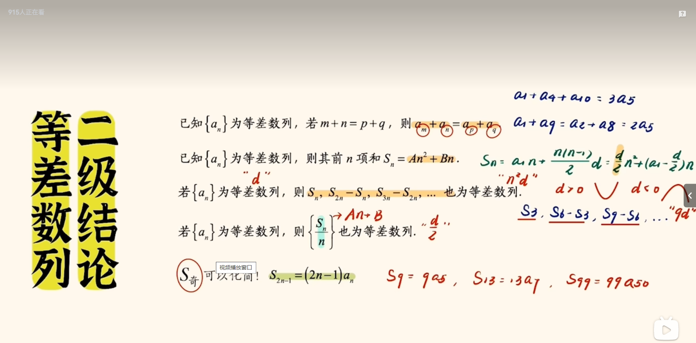

#### 等比数列

- 等比数列定义：

  - 一般的如果1从第二项起，每一项与它的前一项的比都等同与一个常数，那么这个数列就叫做等比数列
- 等比中项计算公式：

  - $$
    \boxed{G^{2}=ab或G=\sqrt{ab}}
    $$
- 等比数列通向公式：

  - $$
    \boxed{a_{n}=a_{1}·q^{n-11}}
    $$
- 等比数列前n项和公式：

  - $$
    \boxed{S_{n}=\begin{cases}na_{1}　(q=1)\\\frac{a_{1}(1-q^{n})}{1-q}=\frac{a_{1}-a_{n}q}{1-q}　(q\not =1)\end{cases}}
    $$
- 等比数列的性质

  1. $\begin{cases}a_{1}>0\\q>1\end{cases}或\begin{cases}a_{1}<0\\aq<1\end{cases}\Rightarrow\begin{cases}\end{cases}a_{n}\begin{rcases}\end{rcases}为递增数列；\begin{cases}a_{1}<0\\q>1\end{cases}或\begin{cases}a_{1}>0\\0<q<1\end{cases}\Rightarrow\begin{cases}\end{cases}a_{n}\begin{rcases}\end{rcases}为递减数列$
  2. $数列m,n,p(m,n,p\in\N_{*})成等差数列，则a_(m),a_{n},a_{p}成等比数列,即a_{n}^{2}=a_{m}*a_{p}$
  3. $若m+n=p+q　(m.n,p,q\in\N^{*})则a_{m}a_{n}=a_{p}a_{q}$
  4. $若\begin{cases}\end{cases}a_{n}\begin{rcases}\end{rcases}是又穷数列，a_{1}·a_{n}=a_{2}·a_{n-1}=a_{3}·a_{n-1}=....=a_{m}·a_{n-m}$
- 等比数列二级结论

  - 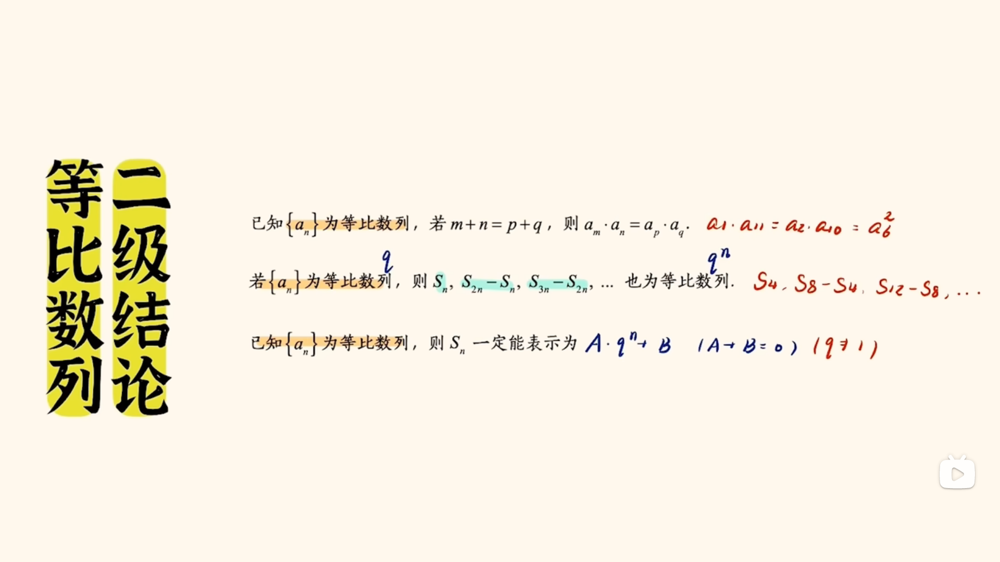

### 解析几何

### 导数

- 定义：

  - $对于函数y=f(x),设自变量x从x_{0}变化到x_{0}+\Delta x,相应的函数值y就从f(x_{0})变化到f(x_{0}+\Delta x).这时，x的变化量为\Delta x,y的变化量为\Delta y=f(x_{0}+\Delta x)-f(x_{0}).$
    **$我们把比值\frac{\Delta x}{\Delta y},即$**

    $$
    \boxed{\frac{\Delta y}{\Delta x}=\frac{f(x_{0}+\Delta x)-f(x_{0})}{\Delta x}}
    $$

    **$叫做函数y=f(x)从x_{0}到x_{0}+\Delta x的平均变化率.$**
    **$如果当\Delta x \rightarrow 0时,平均变化率\frac{\Delta y}{\Delta x}无限趋近一个确定的值,即\frac{\Delta y}{\Delta x}有极限,则称y=f(x)在x=x_{0}处可导并把这个确定的值叫做y=f(x)在x=x_{0}处的导数,记作f'(x)或y'|_{x=x_0}即$**

    $$
    \boxed{f'(x_{0})=\lim\limits_{\Delta x\rightarrow 0}\frac{\Delta y}{\Delta x}=\lim\limits_{\Delta x\rightarrow 0}\frac{f(x_{0}+\Delta x)-f(x_{0})}{\Delta x}}
    $$
- **$求函数f(x)在点x_{0}出的导数步骤$**

  1. **$求函数的增量\Delta y=f(x_{0}+\Delta x)-f(x_{0})$**
  2. **$求平均变化率\frac{\Delta y}{\Delta x}=\frac{f(x_{0}+\Delta x)-f(x_{0})}{\Delta x}$**
  3. **$取极限，得导数f'(x)=\lim\limits_{\Delta x\rightarrow 0}\frac{\Delta y}{\Delta x}=\lim \limits_{\Delta x\rightarrow 0}\frac{f'(x_{0}+\Delta x)-f(x_{0})}{\Delta x}$**
- 基本初等函数求导公式

  1. **$若f(x)=c(c为常数).则f'(x)=0,\Rightarrow 常函数$**
  2. **$若f(x)=x^{a}（a\in Q^{*},a\not=0）,则f'(x)=ax^{a-1}$**
  3. **$若f(x)=\sin x,则f'(x)=\cos x \Rightarrow 三角函数$**
  4. **$若f(x)=\cos x,则f'(x)=\sin -x \Rightarrow 三角函数$**
  5. **$若f(x)=a^{x},则f'(x)=a^{x}\ln a \Rightarrow 指数函数$**
  6. **$若f(x)=e^{x},则f'(x)=e^{x} \Rightarrow 指数函数$**
  7. **$f(x)=\log_{a}(x),则f'(x)=\frac{1}{x\ln a} \Rightarrow 对数函数$**
  8. **$若f(x)=\ln x,则f'(x)=\frac{1}{x}$**
- 导数运算法则

  1. **$[f(x)\pm g(x)]'=f'(x)\pm g'(x)$**
  2. **$[f(x)g(x)]'=f'(x)g(x)+f(x)g'(x)$**
  3. **$[\frac{f(x)}{g(x)}]'=\frac{f'(x)g(x)-f(x)g'(x)}{[g(x)]^{2}}(g(x)\not ={0})$**
- 复合函数的导数
  $对于两个函数y=f(u)和u=g(x),如果通过中间的变量u,y可以表示成x的函数，那么称这个函数为函数y=f(u)和u=g(x)的复合函数,记作y=f(g(x)).$
  $复合函数y=(g(x))发导数和函数y=f(u)mu=g(x)的导数间的关系为y_{x}'=y_{u}'·u_{x}',即y对x的导数等于y对u的导数与u对X的导数的乘积$

### 麦克劳林

1. **$e^{x}\approx1+x+\frac{x^{2}}{2!}+\frac{x^{3}}{3!}$**
2. **$\sin x \approx x-\frac{x^{3}}{3!}+\frac{x^{5}}{5!}+\frac{x^{7}}{7!}$**
3. **$\cos x 1-\frac{x^{2}}{2!}+\frac{x^{4}}{4!}+\frac{x^{6}}{6!}$**
4. **$\ln(1+x)=x-\frac{x^{2}}{2!}+\frac{x^{3}}{3!}+\frac{x^{4}}{4!}$**
5. **$\frac{1}{1-x}=1+x+x^{2}+x^{3}$*

### 题型分析

#### 基础题

- 数列
  - 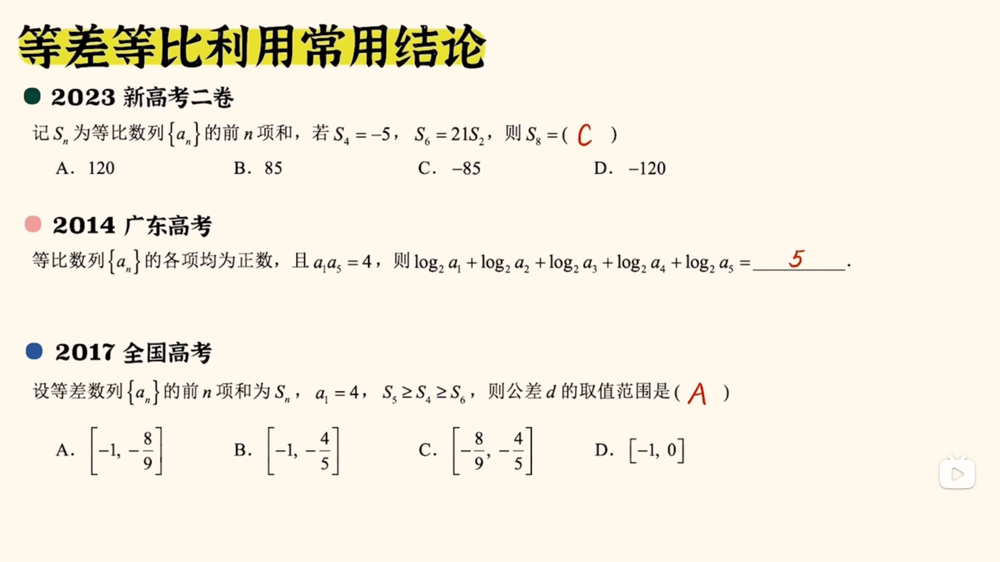

#### 重难题
